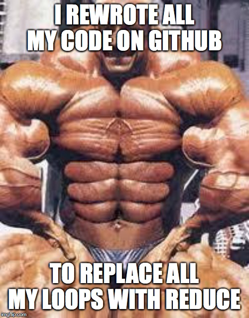

# Reduce, et. al.

`Reduce`, `inject`, `fold`, `accumulate`, `aggregate` and `compress`. All
different names for the same [*higher-order* function][Wikipedia Reduce] that
iterates over an array, returning a single value. This isn't an article about
**how** to use this nugget; Instead I want to convince you that you **should**
use it.

## What's that smell?

There are plenty of great articles, videos and documentation on how to use this
function in your language of choice, so I won't go over that here. But I do want
to touch on the *anti-pattern* or *code-smell* that should make you consider
using reduce and its brethren. Consider the following Ruby code:

```ruby
my_numbers = [3, 50, 17, 5]

def adder(numbers)
  sum = 0 # Create a temporary variable for accumulating

  # Iterate through an array or other enumerable ...
  numbers.each do |num|
    sum += num # ... doing something to our temporary variable
  end

  # Once done, we do something with the temporary variable
  return sum
end

puts adder(my_numbers).inspect
```

The fact that we are creating a variable with an initial value, and doing
something with it as we iterate over an array, should make us think about
whether `inject` would be better. It's a smell that should make us think,
"something may be wrong here." Here's what that code would look like after
refactoring it to use `inject`:

```ruby
my_numbers = [3, 50, 17, 5]

def adder(array)
  array.inject(0) do |sum, num|
    sum + num
  end
end

puts adder(my_numbers).inspect
```

You'll immediately notice that this is a lot shorter. That is **not** a good
enough reason on its own to use `inject`.



Weird flex, but OK.

What we want is *more readable* code, not just shorter code. Shorter code is
generally more readable, but we are adding some *cruft* to the code that adds to
the reader's cognitive load as they try to understand what the code is doing. It
is not immediately clear what the argument to inject does, for example.

## Functional programming

We can generalize that even further and say that we want more readable code
*because* it is easier to maintain and debug. Our goal is to have maintainable,
bug-free code, and shorter, more readable code *usually* helps us get that. Yet,
consider the following code:

```ruby
my_numbers = [3, 50, 17, 5]

def adder()
  my_numbers.inject(0) do |sum, num|
    sum + num
  end
end

puts adder(my_numbers).inspect
```

I've removed the parameter to the `#adder` method, and am instead calling
`inject` directly on the `my_numbers` array, which is defined outside the
method. The code is the same number of lines as before, and is just as
readable. However it is more difficult to maintain and more prone to bugs. If I
move `#adder`, I also have to move `my_numbers` with it. I also can't re-use
adder on another array. And `my_numbers` can end up being changed by another
method, in a way we don't expect, leading to all sorts of difficult-to-squash
bugs. I say all this to drive home the point that neither shorter code nor more
readable code is the goal; *maintainable*, `error-free` code is the
goal. Shorter, more elegant code is a tool to help us get there.

How does the `inject` method help us to write maintainable, error-free code? It
uses functional programming techniques like not mutating state and dependency
injection. In the original `adder` method, notice the `sum` variable we
created. Imagine that, as we add features, we need to add to this method. We
could conceivably end up changing `sum`, only under certain conditions, before
it is used by the `#each` block. That has a potential to arise as a
hard-to-squash bug.

## Levels of abstraction

Computers are incredibly complex marvels of human achievement. At their core
they are a huge collection of precisely interconnected, electronically
controlled switches that do our bidding. For all their complexity, we interact
with them using touches, swipes, clicks, and keypresses, etc., that feel like an
extension of our own bodies and minds. The concept that allows us to bridge the
gap between their complexity and their eas-of-use is abstraction.

The processor of a computer generally only has one way to conditionally execute
instructions. You can think of it this way: you send the processor an
instruction which will output a result. As part of the instruction, you tell it
under which conditions you want it to jump (if the result is > 0, < 0, == 0, or
any combination), and to which instruction in the code it should jump. This is
the basis for all `if`s, loops, and iterations. There is no conditional logic or
looping that cannot be implemented with this primitive construct of comparing a
result with zero and jumping to a different instruction based on that
comparison. If you've ever tried to understand (or worse, write) a program in
assembly, you know it is a tedious task.

Depending on the architechture and language, you might have a virtual machine
language that builds on top of assembly and offers luxuries like `goto`,
`if-then` and `while` statements that wrap up the complicated assembly
instructions in a shorter, easier-to-read format. The computer still ends up
executing the same instructions, but the details are hidden away from
you. That's abstraction.

Modern programming languages (which often compile into VM languages) offer
`if-then` and `while` statements too. They also often provide higher-level
constructs like `for` loops. At some point, somebody noticed a pattern of
`while` loops often being used to step through a range of values, and created
the `for` loop to do just that. This new *abstraction* meant you didn't have to
create a throw-away variable outside of the loop and remember to increment it at
the end of the loop.

```javascript
// ** Javascript **

// Traditional while loop
let i = 0

while (i <= 10) {
  // do something
  i++
}

// The same thing in a for loop
for (let i = 0; i <= 10; i++) {
  // do something
}
```

Again, this isn't just shorter and easier to read; it's more maintainable and
portable, and less error-prone. It's not a subjective style issue; the `for`
loop is objectively better code for that situation.

You've no doubt noticed that you most often use `for` loops to iterate over an
array:

```javascript
my_array = [/** some items in here **/]

for (let i = 0; i < my_array.length; i++) {
  // do something with my_array[i]
}
```

So why not write a function that hides away all the nastiness of creating and
incrementing `i`, and checking the length of the array:

```javascript
const forEach = (arr, cb) => {
  for (let i = 0; i < arr.length; i++) {
    cb(arr[i]);
  }
};

my_array = [/** some items in here **/]

forEach(my_array, (item) => {
  // do something with *item*
}
```

Now we can cleanly express that we want a chunk of code to run on every element
of an array. It's impossible to introduce bugs on any of the iteration logic
because it's wrapped up in a forEach and hidden from us. (The `forEach` here is
written to act on an array that is passed into it. The real `forEach` provided
by Javascript is a method on the instance variable.)

There's something new going on here. We are passing a function as an argument to
another function. Not all programming languages can do this and it is a strict
requirement for the *functional programming* paradigm.

`reduce` and `inject` are a further abstraction on top of more primitive loops
that allow us to express the pattern of extracting data out of an array. Re-read
the names that this function has (in the various languages) on the first line of
this article. Their names should make more sense now.

`Enumerable#each` (Ruby) and `Array.prototype.forEach` are likely written using
`inject` and `reduce` respectively. They are further abstractions. Same with the
various `select`, `find`, `map`, etc. methods. They build on the abstraction
provided by `inject`/`reduce`.

## Reduce in the wild

`reduce` and its cousins have become wildly popular over the past few years with
the popularity of functional programming. Entire libraries have been written
around the pattern ([Redux](https://redux.js.org)). And even popular frameorks
like [React](https://reactjs.org) have been re-worked to take advantage of the
pattern (`useReducer`).

As developers we need to be careful not to buy in to the latest programming fad
just because all the cool devs are doing it. The cost of being a good dev is
eternal vigilance. When we see something gaining in popularity, we need to do
our homework to figure out what this "new something" aims to solve. Instead of
just using the new tool blindly, we should understand the *when* and
*why*. Hopefully this article has helped you understand the *when* and *why* of
`reduce` and its kin.

[Wikipedia Reduce]: https://en.wikipedia.org/wiki/Fold_(higher-order_function)
